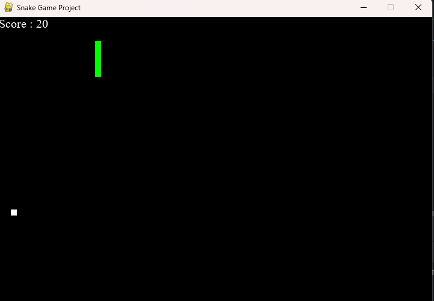
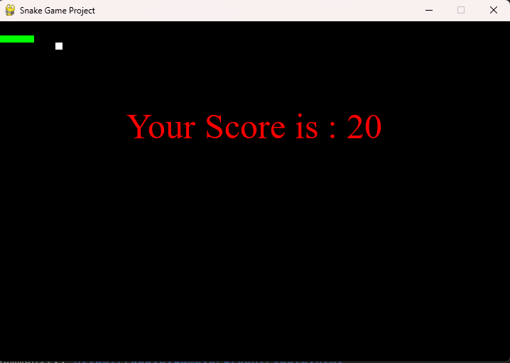

# 🐍 Snake Game
A simple Snake game made in Python, using `pygame` library. // Um simples jogo da cobrinha (Snake Game) feito em Python, com interface gráfica usando `pygame`.

## 🎮 Como Jogar // 🎮 How to Play
[PT-BR]
- Use as **setas do teclado** para mover a cobrinha (↑ ↓ ← →). 
- Coma a comida vermelha para crescer e ganhar pontos.
- Não colida com as bordas ou com o próprio corpo, ou o jogo acaba!  
[EN-US]
- Use the **arrow keys** to move the snake (↑ ↓ ← →).  
- Eat the red food to grow and earn points.  
- Do not collide with the walls or your own body, or the game will end!
